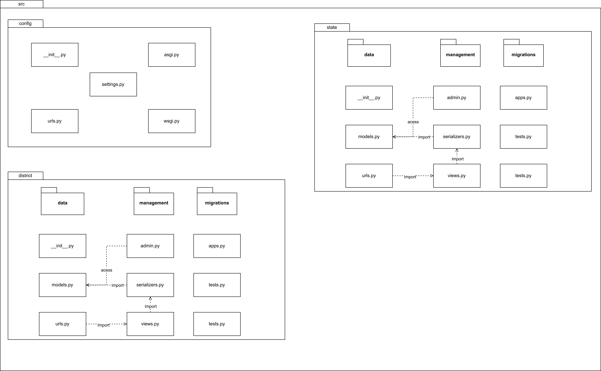
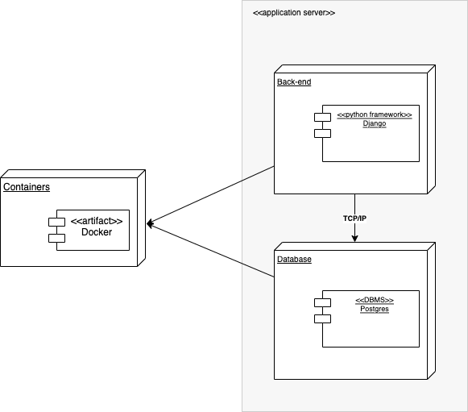

# Backend Architecture - Atlas

## Logical View

### Package Diagram 

The goal here is to show the organization and arrangement of backend elements in the form of packages.

<figure>

  
  <figcaption style="text-align: center !important">
    Fonte: Autores
  </figcaption>
  
</figure>


## Implantation view


Decomposition of the software into layers and subsystems in the implementation model.

<figure>

  
  <figcaption style="text-align: center !important">
    Fonte: Autores
  </figcaption>
  
</figure>


## Data View

In this section the data saved on database is described.

- Model District

| Data     | Type          | Required |
| -------- | ------------- | -------- |
| name     | string        | Yes      |
| type     | string        | Yes      |
| geometry | polygon field | No       |
| CD_MUN   | string        | No       |
| NM_MUN   | string        | No       |
| SIGLA_UF | string        | No       |
| AREA_KM2 | integer       | No       |

Example:

```
    "name": "Brasília"
    "type": "Feature",
    "geometry": "Polygon(((0.0, 0.0), (0.0, 50.0), (50.0, 50.0), (50.0, 0.0), (0.0, 0.0)))",
    "CD_MUN":"5300108",
    "NM_MUN":"Brasília",
    "SIGLA_UF":"DF",
    "AREA_KM2": 5760.784
```

- Model State

| Data       | Type          | Required |
| ---------- | ------------- | -------- |
| name       | string        | Yes      |
| type       | string        | Yes      |
| geometry   | polygon field | No       |
| CD_UF      | string        | No       |
| POPULATION | integer       | No       |
| NM_UF      | string        | No       |
| SIGLA_UF   | string        | No       |
| NM_REGIAO  | string        | No       |

Example:

```
    "name": "Distrito Federal",
    "type": "Feature",
    "geometry": "Polygon(((0.0, 0.0), (0.0, 50.0), (50.0, 50.0), (50.0, 0.0), (0.0, 0.0)))",
    "CD_UF": "53",
    "POPULATION": 3094325,
    "NM_UF": "Distrito Federal",
    "SIGLA_UF": "DF",
    "NM_REGIAO": "Centro-oeste"
```

